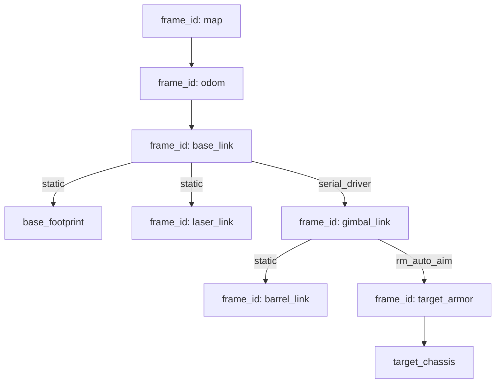

# Venom Robot TF Tree

## Frame 说明

| Frame            | 发布者            | 说明                         |
|------------------|-------------------|------------------------------|
| `map`            | —                 | 全局固定坐标系（根节点）     |
| `odom`           | `/cloud_registered` | 里程计坐标系               |
| `base_link`      | `/cloud_registered` | 机器人本体坐标系           |
| `base_footprint` | static            | 车外框线投影坐标系           |
| `laser_link`     | static / `/livox` | 激光雷达坐标系               |
| `gimbal_link`    | `/serial_driver`  | 云台坐标系                   |
| `barrel_link`    | static            | 炮管坐标系                   |
| `target_armor`   | `/rm_auto_aim`    | 装甲板目标坐标系             |
| `target_chassis` | `/rm_auto_aim`    | 底盘目标坐标系               |
